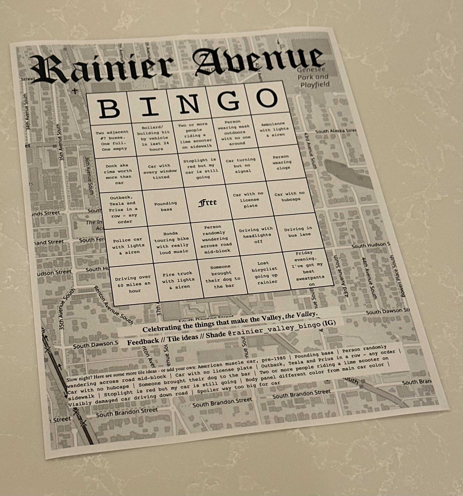

### Rainier Avenue Bingo

If you live in Seattle's South End you have likely marveled at Rainier Avenue at some point. Grab one of the bingo sheets generated by this app, take it to your favorite establishment on the ave and see who wins.

Want to make your own for your neighborhood? Go for it!

Code is pretty simple - each card is a PDF that pulls from a list of items and number of cards you specify. You call it via `python bingo.py` and each card is a separate PDF.

Here's a sample:

